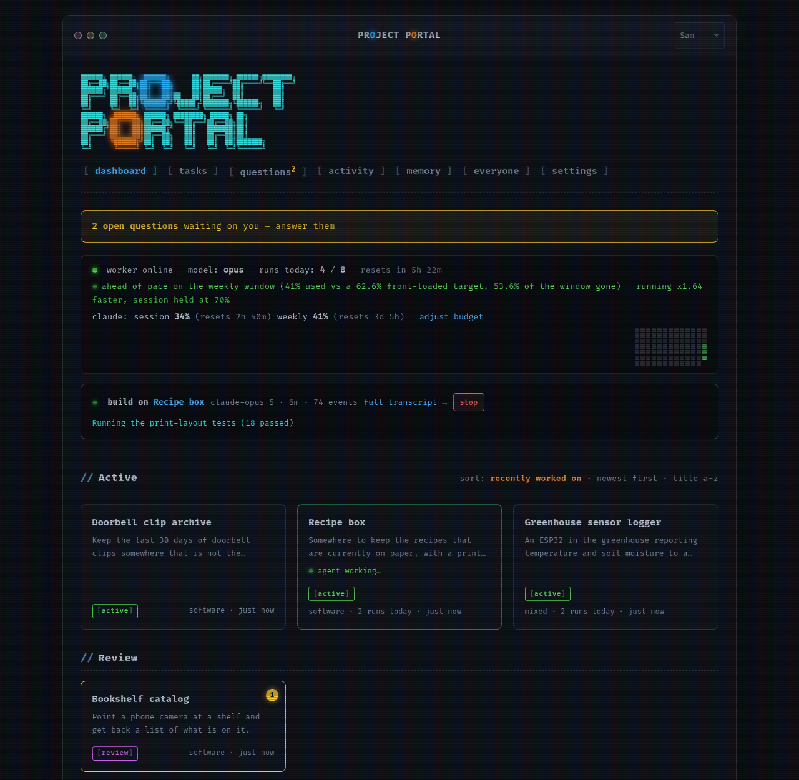
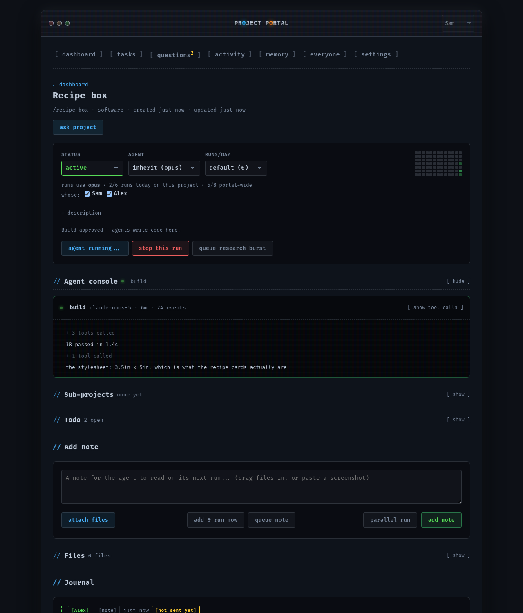
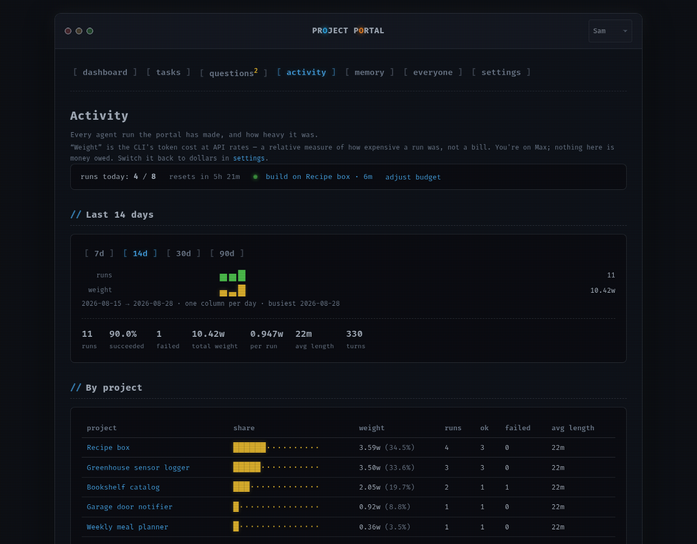
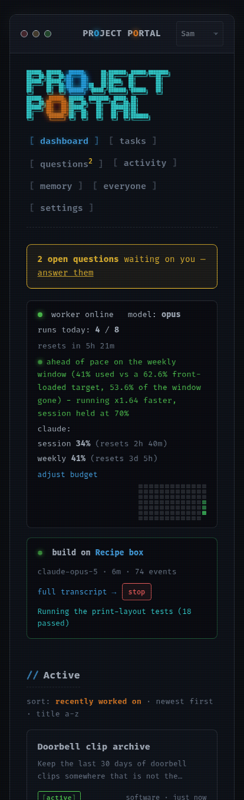

# Project Portal

**Write down an idea. Come back to working code.**

A self-hosted board that runs [Claude Code](https://claude.com/claude-code)
against your projects on a schedule, in a workspace per project, and reports
back to your phone. FastAPI + SQLite, no build step, one file of JavaScript.



*Every screenshot on this page is made-up data from `deploy/demo_data.py` — run
it yourself and click around before installing anything.*

---

### It does the work, and shows it happening

The agent gets a real directory, writes real code, runs the tests and commits.
The console streams live while it works, and any note you type goes into the
next run's prompt.



### It asks instead of guessing

A run that hits a decision only you can make files a question with one-tap
answers and waits. The same question never reaches you twice in two wordings.

### It paces itself against your subscription

The worker reads your live usage window and spreads runs across it instead of
burning a week by Tuesday. Every run's weight is on the record.



### It is built to be read on a phone



---

## What makes it different from a task list

- **The agent actually does the work.** A run gets a real workspace, writes
  real code, runs real tests and commits. Writing code waits for your approval;
  planning and research do not.
- **It asks rather than guesses.** A run that hits a decision only you can make
  files a question with one-tap answers, and the same question never reaches
  you twice in two wordings.
- **It paces itself against your subscription.** The worker reads the live
  usage meter and spreads runs across the window instead of burning it by
  lunchtime — and offers to spend headroom that would otherwise expire.
- **It reviews itself.** Before a run's work reaches you, a read-only critic
  checks the committed diff against what the run claims. Runs that overstate
  themselves go back on the shelf instead of into your review queue.
- **It keeps memory.** Profile and learnings files, compacted on a schedule
  from journal evidence rather than accumulating forever.
- **Two agents can work one project at once.** Press **parallel run** on the
  note form while an agent is already going and a second one starts in a git
  worktree of its own, on its own branch, merged back when the workspace is
  free — never two agents in one checkout.

## Try it before you install it

```bash
python3 deploy/setup.py            # builds the venv
venv/bin/python deploy/demo_data.py 8598
```

That boots the whole portal against a throwaway database full of invented
projects, runs, questions and memory — the board in the screenshots above. It
uses its own directory under `/tmp`, cannot reach your Claude account and
cannot start a run.

## Requirements

- Python 3.11+ and `pip install -r requirements.txt`
- The [Claude Code CLI](https://claude.com/claude-code) — either logged into a
  subscription, or pointed at an Anthropic API key (see below).
- `git` for the per-project workspaces.
- Optional: Docker, for voice-note transcription. Build the engine once with
  `docker build -t portal-whisper:latest deploy/whisper/` (whisper.cpp, its
  base.en model and ffmpeg, run per-memo in a no-network container) and
  recorded voice notes get their words stored, shown under the player, and
  quoted in the agent's prompt. Without it memos still upload and play; they
  just stay untranscribed.

Other model providers are **not** supported. The design leans on the Claude
CLI specifically — its hooks, `--json-schema` structured output, `--max-turns`
and the subscription usage endpoint.

## How runs get paid for

Two arrangements, set by `auth_mode` in `portal.toml`.

**`subscription`** (the default, and what the portal was built for). The CLI's
own login. Headless runs bill nothing, so the real budget is the account's
usage window — which the portal reads live and paces itself against, spreading
work across the window instead of burning a week by Tuesday, and offering to
spend headroom that would otherwise expire unused.

**`api_key`**. Runs are billed per token. Two things change automatically:

- **A per-run dollar ceiling applies by default** ($5.00, changeable on the
  Settings page). An unattended scheduler with no cap is how a runaway loop
  becomes an invoice, so "unset" here means the default rather than infinity.
- **Subscription pacing switches off entirely.** Those windows describe a
  subscription your runs are not spending, so pacing against them would hold
  work back for no reason — and it would happen, because an API-key user
  usually has the CLI logged in too and the usage endpoint answers happily.

Put the key in `secrets/anthropic_key.txt` (gitignored, alongside the portal's
other credentials) or in `$PORTAL_ANTHROPIC_API_KEY`. `$ANTHROPIC_API_KEY` is
used if neither is set — but only once you have opted in.

> **The key is never auto-detected, on purpose.** In subscription mode
> `ANTHROPIC_API_KEY` is *stripped from every spawn*, so a key that leaks into
> the portal's environment — a sourced `.env`, a CI variable, a shell profile —
> can never quietly start billing your card mid-run. Switching modes is one
> config line and cannot happen by accident. If you have a key set but are in
> subscription mode, the portal says so on the dashboard rather than leaving
> you to wonder why it "isn't working".

## Install

```bash
git clone <this repo> project-portal && cd project-portal
python3 deploy/setup.py
venv/bin/uvicorn app.main:app --host 0.0.0.0 --port 8500
```

`deploy/setup.py` is idempotent, checks the prerequisites, builds the
virtualenv, and ends by booting the app on a scratch port and asking it
`/api/ping` — so it reports success only after a real HTTP request got a real
answer. It never prompts: anything that needs a person (logging the Claude CLI
in, confirming the hostname is one your phone can resolve) is printed at the
end as a list rather than blocked on. `--check` reports without changing
anything.

Then open it from another device. `deploy/project-portal.service` is a systemd
user unit that works unedited if your checkout is at `~/project-portal`.

**[AGENTS.md](AGENTS.md) is the same thing written for an agent** — hand a
coding agent this repo and that file and it can bring the portal up on a new
machine, hand back the two things it cannot do itself, and know which guard to
run before pushing anywhere public.

## Keeping an install up to date

```bash
python3 deploy/update.py          # do it
python3 deploy/update.py --check  # report only, change nothing
```

Fetches, fast-forwards, reinstalls dependencies **only if `requirements.txt`
actually moved**, checks that the new code imports, restarts the systemd unit
if there is one, and then asks the restarted portal for `/api/ping`. If there
is no unit it says so rather than guessing how you start it.

It is deliberately unwilling to do anything clever:

- **It never merges.** The pull is `--ff-only`. A checkout with commits your
  remote does not have is a hard stop that names both sides and changes
  nothing — a follower that has only ever fast-forwarded is always sitting on
  a published commit, and one that has merged local work is a fork whose shape
  nobody knows.
- **An uncommitted edit to a tracked file stops it** before git is asked to do
  anything, and the files are named. Untracked files are ignored: `data/`,
  `secrets/` and `portal.toml` are all untracked and a fast-forward cannot
  touch them.
- **It checks before it restarts.** Dependencies go in and the app is imported
  on the new tree while the old process is still serving, so the usual failure
  — a requirement that moved — is caught with the portal still up.

Both `deploy/setup.py` and `deploy/update.py` set `PORTAL_SMOKE_TEST=1` when
they boot or import the app to check it. That flag means *this process is not
the service*: no worker loop (which would schedule a real, billed agent run —
on an empty board the first tick goes straight to the daily reflect), no
orphaned-run reconciliation (which against a live data directory settles the
**running** service's runs), and no preview server binding a port out from
under the portal you are checking.

### A follower that updates itself

`deploy/project-portal-update.timer` runs `deploy/update.py` every half hour.
Install it beside the service unit:

```bash
cp deploy/project-portal-update.service deploy/project-portal-update.timer ~/.config/systemd/user/
systemctl --user daemon-reload && systemctl --user enable --now project-portal-update.timer
```

## Running more than one

An install can know about the others. **Settings → access → other portals**
takes a name, the other portal's URL and, optionally, an ssh target. From then
on this portal asks that one `/api/node` every two minutes and shows, on the
dashboard's status line and in settings, whether it is up and which commit it
runs — compared against the last commit *this* install published, so "behind"
means what it says even though the public repository's history is unrelated to
the source's.

With an ssh target, **update now** runs `deploy/update.py` there, and the
install that publishes the mirror does the same automatically a few minutes
after every publish — once the node reports no agent run in flight, so a
restart never lands in the middle of one. The follower's own timer is the
backstop for when it cannot be reached. The push needs this machine's ssh key
in that account's `authorized_keys`; nothing else is configured on the far side.

## Configure

**Nothing is required.** With no config at all the portal reads the machine
itself: the system hostname, the account it runs as, and that account's real
name from GECOS. On a home server that is usually already right.

Copy `portal.example.toml` to `portal.toml` (gitignored) to change any of it —
owner name, gender, hostname, ports, SSH user, ntfy channel. Every key is
also an environment variable, `PORTAL_HOST` and so on.

The one setting worth checking is `host`: every URL the portal and its agents
print is read on *another device*, so a hostname that only resolves locally
makes every one of those links dead. The portal says so on startup if the name
it guessed looks unusable.

Your own material — the database, workspaces, memory files, credentials,
`portal.toml` — all lives under `data/` and `secrets/`, both gitignored. None
of it has ever been committed. `app/leakscan.py` is a standing check that the
source never names *your* infrastructure either; it derives what to look for
from your own config, so it protects whoever installs it next as automatically
as it protects the author.

## URLs

Runs on `0.0.0.0:8500` by default. Reach it at `http://<your-host>:8500`.

- `/` — dashboard: quick-add ideas, open-questions banner, project cards,
  worker status, recent activity.
- `/project/<slug>` — project detail: status/priority/agent/runs-per-day,
  live agent console, journal, open questions, workspace file browser (view or
  download each file, plus a copyable `ssh … -t 'cd <workspace>'` line), runs
  table, "Run now", add-note form.
- `/activity` — every run ever made: feed with filters, usage sparklines over
  7/14/30/90 days, and a per-project breakdown of where the budget went.
- `/run/<id>` — one run's stats and full transcript (streams if it's still
  going), with a stop button while it is running.
- `/questions` — all open questions across projects.
- `/memory` — profile.md / learnings.md editors + suggestions list.
- `/settings` — worker + notification settings, test notification button.
- `/file/<slug>/<path>` — safe text file viewer for a project's workspace.
- `/download/<slug>/<path>` — the same file as a download: no size or text-only
  limit, always served as an attachment under `application/octet-stream`.
  Workspace files are written by agents, so serving one inline would be script
  execution on the portal's own origin.
- `/api/status` — JSON health check.
- `/api/usage` — run budget: used/base/bonus/remaining and when it resets.
- `/api/active-run` — the run currently in flight (task, project, model,
  elapsed, event count, latest activity line) plus the usage block.
- `/api/run/<id>/log?offset=<n>` — incremental tail of a run's transcript;
  pass back the `offset` from the previous response to get only what's new.

## How it works

### Data

Everything lives under `data/`:

- `data/portal.db` — SQLite database (projects, journal, questions, runs,
  suggestions, settings). Created automatically on first run, with seed
  data (see below).
- `data/memory/` — `profile.md`, `learnings.md`, `suggestions.md`: the
  system's persistent memory about Wes, refreshed by the daily reflect job
  and by individual agent runs.
- `data/projects/<slug>/` — one workspace directory per project. This is
  the agent's `cwd` when it works on that project — it's a real directory
  the agent can `git init`, write code into, run tests in, etc. The
  `project-portal` project (this app itself) is the one exception: its
  workspace directory just contains a note pointing at the real source at
  `~/project-portal`, since the meta-project *is* the running app.

Project state is the redesigned model from
[`docs/state-model.md`](docs/state-model.md) (implemented 2026-07-23): a
user-owned `stage` (`backlog | active | review | done | abandoned`,
`PROJECT_STAGES` in `app/config.py`), an orthogonal `paused` timestamp only Wes
sets, and agent-reported facts (`build_requested`, `blocked_on`). Everything
else — whose turn it is, which dashboard shelf a card sits on — is derived per
render (`db.project_shelf`, `db.display_state`). The old eight-value `status`
column was migrated by `db._migrate_status_to_stage` and survives one release
as `status_old`; the old vocabulary is still accepted everywhere it could
arrive (agent reports, the `/status` route, Telegram) via
`config.LEGACY_STATUS_STAGE`.

### Background worker

An `asyncio` task started on app startup (`app/worker.py`) loops every 60
seconds. On each tick, if it is not in backoff, it fills every free run slot:
for each one, if the worker is enabled, under the daily run cap, and enough
time has passed since the last run (or a manual "Run now" was queued), it:

1. Picks a project — the manual queue first, else the highest-priority /
   oldest-updated `active`, unpaused project, skipping any project that
   already has a run in flight, any with an unanswered build request (see
   "The build gate"), and any that is blocked on Wes (or holding only open
   questions) with no workable agent todos left. The backlog is never
   scheduled — feeding an idea to a model is a deliberate act.
2. Picks the task: approved (or gate off) → build; unapproved → plan (or
   triage for a project that has never had a completed run).
3. Builds a prompt (`app/agent_runner.py`) with the task instructions, the
   project's recent journal, answered Q&A, and the current memory files.
4. Runs `claude -p "<prompt>" --model <model> --output-format stream-json
   --verbose --dangerously-skip-permissions --max-turns 100` with `cwd` set
   to the project's workspace directory, under a timeout. The stream format
   (rather than a single `json` blob at the end) is what makes the live
   console possible — see "Watching a run" below. The CLI is started in its
   own process group so a timeout can kill its children too; killing only the
   parent would leave grandchildren holding the pipes open.
5. Runs it as a background task, so the loop keeps ticking and can start work
   on a *different* project while this one is still going.
6. Reads back `.portal/report.json` that the agent is required to write
   before finishing (summary, journal entry, status/kind/title changes,
   new questions, learnings, an optional new-project suggestion) and
   applies it: updates the project row, journals the progress entry,
   inserts questions (and notifies), appends learnings, and records any
   suggestion.
6. Detects usage/rate-limit responses and backs off for 60 minutes instead
   of counting it as a normal error.

### The build gate

Agents triage and plan any project unasked — those passes are cheap, reversible,
and produce a title, an assessment and a `PLAN.md`. Writing the project's code
does not happen until Wes says so.

`projects.build_approved` is that permission. An agent setting `new_status` to
`building` is a *request*: the portal records it in `projects.build_requested`
(the project stays `active`, folded to the Paused shelf with a "needs your OK"
badge), journals it once, and notifies. Approval comes from Wes choosing
`active` in the status picker, pressing **approve build** on the project page,
or saying so over Telegram. The gate is `settings.require_build_approval` (on
by default).

This exists because it failed the other way first: a pass over the backlog
triaged every idea, each triage promoted itself to `planning`, each plan
promoted itself to `building`, and seventeen projects started building
themselves until the usage limit stopped them.

A manual run on a gated project still runs — it just runs `plan` rather than
`build`, so neither the button nor the Telegram `run` command can start writing
code around the gate. The migration back-fills approval only where the journal
shows Wes himself moved a project into `building`, plus the portal's own
project; grandfathering everything in would have preserved exactly the
behavior the gate exists to stop.

Once a day (after 4am local, tracked via `settings.last_reflect_date`), the
worker also runs a "reflect" pass with `cwd = data/memory`, which rewrites
`profile.md` from a recap of recent cross-project journal activity.

### Watching a run

`app/runlog.py` turns each stream-json event into one or more display lines
(`> Bash(pytest -q)`, `< ok (3 lines)`, `* run complete  (12 turns, $0.421)`)
and appends them to `data/runs/<run_id>.log`. The newest line is also written to
`runs.last_activity` with an event count, so the dashboard can show what the
agent is doing without reading the file.

The dashboard shows a live strip with the running task and its latest activity,
and the running project's cell gets a pulsing green indicator. The project page
has an "Agent console" that tails the log by byte offset every 2s (falling back
to the last finished run's transcript when nothing is running). Both pollers are
best-effort — a failed fetch skips a tick rather than killing the widget — and
the page reloads once when a run starts or ends, since that changes far more of
the page than the console.

Log files are append-only (an offset handed out earlier always stays valid) and
pruned to the newest 200 when a run starts.

### Stopping a run

`POST /run/<id>/cancel` (the "stop" button on the dashboard strip, the project
console and the run page) SIGKILLs the run's whole process group — the `claude`
CLI plus every tool child it spawned, which is why runs are started in their own
session. Live processes are tracked in an in-memory registry keyed by run id; a
"running" row with no entry there is a leftover from a restart, so canceling it
just settles the row (leaving it would deadlock the worker via
`is_run_running()`).

Canceled is its own run status, not an error: canceled runs are excluded from
the failure count and from the success rate, which is computed over runs that
actually reached a verdict.

### Pausing a run, and talking to one

`POST /run/<id>/pause` holds a live run at its **next tool call**, and
`POST /run/<id>/resume` lets it go. Nothing is generated or billed while it
holds: the CLI is between two turns, waiting on its PostToolUse hook, and the
portal simply does not answer that hook until you resume (the relay polls
`/hooks/hold` every few seconds). A pause pressed while the model is part-way
through a reply engages once that reply's tool call lands — the page says
"pausing" until then and "paused" after — because cutting a reply off would
mean paying for it again on resume. The run's time limit counts running time
only, so a long hold is not a step closer to a timeout.

A note added to a project while its agent is working waits for the next run by
default. Press **deliver mid-run** instead — on the note form, or on the note's
journal entry afterwards — and it reaches that agent at its next tool call,
injected beside the tool result as the hook's `additionalContext`, in the same
session, with nothing restarted. It is stamped delivered to that run, so no
second run is queued for it afterwards. A note that arrives after the run has
filed its report waits for the next run whatever it was pressed as. Files
attached to such a note are moved into the workspace first, and a voice memo is
held back until its transcript exists. The run page lists every hold and every
note it heard under "while it ran". See `app/midrun.py`.

Both ride the PostToolUse hook, so a run started before the last portal
restart — whose hook scope died with that process — can do neither, and the
buttons are not offered for it. The switch is Settings > agent > "Pause a run,
and hand it notes while it works".

### A run that outlives a restart

The portal restarts itself to load its own updates, and a run in flight keeps
going: each run lives in its own systemd scope, which a service restart does
not touch, and the new process adopts it rather than starting a second agent
into the same workspace. What the new process does not have is the run's
stdout, so the `result` event carrying its report would go down a dead pipe.
The CLI writes every turn to a transcript on disk as it goes
(`~/.claude/projects/<encoded cwd>/<session id>.jsonl`), including the
StructuredOutput call with the report as its input, so when the adopted run's
scope dies the portal reads the report back out of that file and files the run
exactly as a watched one: ok, the summary on the run list, the journal entry,
todos, questions and stage on the project, plus a status line saying the
report was recovered. The session id that names the transcript is recorded
from the CLI's first stream event, not at the end. A transcript with no report
in it — the agent was killed mid-work — still settles as an error, so a run
that failed is not dressed up by its last words. What a recovered run lacks is
its cost, which only the stream carries, and an undo button, since nobody
wrote down the workspace HEAD before it started. See `app/transcript.py`.

### Where the budget goes

`/activity` groups the window's runs by project, ranked by cost rather than run
count — one long run can outweigh several short ones. Runs with no project (the
daily reflect) get their own row so the shares still sum to the window total,
and if nothing in the window has a recorded cost the shares fall back to run
counts rather than drawing every bar empty.

### Canceling from Telegram

`/stop` (or just "stop that") kills whatever run is in flight, via the same
`worker.cancel_run` path as the web button. If a project is named it must be
the one actually running — killing a *different* run than the one asked about
would be a nasty surprise from a phone, so that case reports what's really live
instead. `/status` leads with the live run, its latest activity line and the
remaining daily budget, since that's what "how's it going" means from a phone.

### Reading the cost figure

`total_cost_usd` from the CLI is what those tokens *would* cost at API rates.
Wes is on a Max subscription and isn't billed per token, so a dollar sign
overstates it. By default the UI renders the same number as **weight**
(`0.421w`) — same magnitude, same ordering, no claim about money. Settings →
*Show run cost as* switches it back to dollars. Rendering goes through
`usage.format_cost` / `cost_noun` and the `|cost` Jinja filter, so the choice
lives in one place. Run transcripts are frozen at write time and always use the
weight suffix. An unpriced run renders as `-`, not `0` — "we don't know" is a
different statement from "it was free".

### Parallel runs

`max_parallel_runs` (Settings → agent, default 2) is how many agent runs may be
in flight at once. They are always on **different projects**: two agents in one
workspace would fight over the same files and the same git checkout, so a
project with a run in flight is skipped for scheduled picks, and a manual "Run
now" on it is re-queued for a later tick rather than dropped or doubled up.

Free slots are not license to launch everything at once — the pacing interval
still applies to scheduled runs. While anything is in flight the interval is
measured from the most recent run *start* rather than the last run's end (a run
that has not ended has no `ended_at`, which would otherwise leave the gate
permanently open). So parallelism happens when a run outlives the interval,
which is exactly when it is worth having. Queued manual runs bypass pacing and
all start together.

`spawn_run` writes the `runs` row *before* returning, so by the time the loop
considers the next slot both the daily budget count and the set of busy
projects already include the run it just started. Set `max_parallel_runs` to 1
for the old strictly-serial behavior.

### Why nothing is running

When the dashboard says "no agent running" it also says *why*:
`worker.idle_reason()` re-uses the same predicates the tick decides with — in
backoff, worker paused, budget spent (with the time until reset), nothing in an
actionable status, every project at its own cap, or pacing (naming the project
that is next up and roughly when). It is also the reply to "how's it going" over
Telegram, and it ships in `/api/active-run` alongside `runs`, the full list of
what is in flight.

### The run budget

Three independent limits, all visible in the UI:

- **`max_runs_per_day`** (Settings) — the permanent daily budget.
- **A bonus** (Settings → Today's budget, `+1 / +3 / +10`) — temporary. It's
  stored with the UTC date it was granted for, so it expires by itself at the
  reset rather than quietly inflating the budget forever.
- **`projects.max_runs_per_day`** — an optional per-project daily cap. A project
  at its cap is skipped for scheduled runs (the worker moves on to the next
  candidate rather than stalling), but a manual "Run now" always goes through.

The daily counter is keyed on the UTC date; `/api/usage` reports exactly when it
resets rather than leaving that implicit.

### Choosing the agent

Settings has a dropdown of the models the worker can use (`opus`, `sonnet`,
`haiku`); `opus` is the default. Each project page has the same dropdown plus
an "inherit global" option, stored in `projects.model` — `NULL` means inherit.
`agent_runner.resolve_model()` resolves per-project override → global setting →
`config.DEFAULT_MODEL`, so an unknown or stale value can never reach the CLI.

### Asking a question instead of starting work

Sometimes the thing you want is smaller than a run: "why that display?", "is
the plan written yet?". `app/ask.py` answers those without anything changing.
The **just asking** box on a project page (and `/btw <project> <question>` over
Telegram) starts a read-only `claude -p` in the project's workspace:

- It writes **no `runs` row**, so it doesn't count against the daily budget,
  the parallel cap or the pacing interval. Asking never starves the thing
  you're asking about.
- It is started **without** `--dangerously-skip-permissions` and with an
  explicit allow-list (`Read`, `Glob`, `Grep`, `WebSearch`, `WebFetch`) plus a
  deny-list (`Bash`, `Edit`, `Write`, ...), so the read-only posture is enforced
  by the CLI rather than by the prompt asking nicely.
- Nothing it says is applied: no status change, no new questions, no
  `report.json`.

Both halves land in the project journal (`user/ask`, then `agent/answer`)
minutes apart, which means asking a question is also a way of telling the next
run something. One ask at a time per project. The model is Settings > agent >
**question model** (`ask_model`, default `sonnet`).

### Telegram bot

**Off by default.** Tick *Telegram integration* in Settings → notifications to
turn it on; the bot polls only while both that switch and a token are set.

The switch also controls **question numbers**. A question wears a short number
("Q7") so you can address it in a chat — `Q7: yes` — and with no bot to type it
at, the number addresses nothing, so it is not shown. Turning the integration
on brings the numbers back, including on questions that are already open.

When it is on, `app/telegram_bot.py` long-polls `getUpdates`. It handles
messages in two layers:

1. **Explicit forms**, matched first and never sent to a model: a reply to a
   question message, `#<id> <answer>`, `/answer <id> <text>`, `/idea <text>`,
   `/status`, `/stop` (or `/cancel`), `/help`,
   `/btw <project> <question>` (an ask — see above; `/ask` is a synonym, and
   the project resolves from an exact slug, an unambiguous slug prefix, or an
   unambiguous title prefix). Stopping a run is deliberately
   in this layer: it's the one thing that has to keep working when the NL
   router is off, slow or unavailable.
2. **Natural language** (`app/nl.py`), if "Understand plain English" is on in
   Settings. A short `claude -p --model haiku` call classifies the message
   into an intent — answer a question, add an idea, leave a note on a project,
   ask a read-only question about one, ask for status, change a project's status, run a project now, or cancel the
   run currently in flight. The router is given the currently-open questions,
   the active projects and the live run so it can resolve "the portal one" to a
   real slug and "stop that" to a real run, and `nl.parse_intent` rejects any id or
   slug the model invented. Low-confidence or unresolvable messages fall back
   to creating an idea, which is what most unclassifiable messages are.

If the toggle is off (or the CLI is unavailable), plain text becomes a new
idea, exactly as it did before.

### GLaDOS mode

`app/persona.py` holds the bot's outbound voice. With "GLaDOS personality" on
in Settings, the bot's own confirmations ("answer recorded", "created project
X") and notification headers get the snarky Aperture Science treatment; with it
off they're literal. The variants are canned rather than model-generated — a
round trip per two-word acknowledgement isn't worth the latency — and are
chosen deterministically from a hash of the plain text, so the same event
always reads the same way.

Agent output, journal entries, and question text are **never** rewritten by the
persona layer. Only the portal's own chrome changes voice.

### Notifications

`app/notify.py` sends new questions and suggestions to Telegram (if a bot
token + chat id are configured) and always also tries ntfy — both are
best-effort and never crash the app or worker.

If no chat id is configured yet, the bot adopts the chat id of the first
incoming message and ignores every other chat.

## Look and feel

### Themes

Two ship: **terminal** (the default, described below) and **paper** — warm,
light, printed, with a serif for anything you read. Settings → appearance.

A theme is a class on `<body>` and a block in `app/static/themes.css`, loaded
after `style.css`, so terminal is the *absence* of any rule in that file.
Adding a third is an entry in `config.APPEARANCE_CHOICES["ui_theme"]`, a
color in `config.THEME_CHROME` (the pre-CSS `<meta>` that stops a flash of
the wrong shade on load), and a `body.theme-<name>` block.

Two rules that file lives by, both enforced by `tests/test_themes.py`:
**nothing functional** — no `display`, `position` or `visibility`, because a
theme that can hide a control is a look you cannot get out of — and every
selector names a theme, so a stray rule cannot change the shipped look.

Themes and the CRT layers below are **per person**, stored as a subset: choose
nothing and you follow the install as it changes; pin one layer and you still
follow the rest. Settings → appearance also offers **see it as someone else
does**, which renders every page in another person's look. That is a preview
and reaches nothing but the CSS — notes you write are still attributed to you,
and anything you save is still saved against you.

### The terminal theme

Fira Code, a dark CRT-scanlined window frame with traffic-light dots,
`[ bracketed ]` nav tabs, and ANSI-colored status badges. Projects are cells in a grid, like
the tool cells on the site; a cell with open questions gets a pulsing yellow
count pip and a yellow border.

The wordmark is ASCII art where the two `O` glyphs are the Portal gun's blue and
orange portals (`app/templates/_banner.html`). Each line is split into three
`<pre>` segments so the `O` can be colored and animated on its own; each
segment's widest row is exactly its glyph width, which is what keeps the
segments butted together correctly.

## Running it

```bash
cd ~/project-portal
python3 -m venv venv          # if venv/ doesn't exist yet
source venv/bin/activate
pip install -r requirements.txt
uvicorn app.main:app --host 0.0.0.0 --port 8500
```

The database and memory files are created automatically (with seed data) on
first startup if `data/portal.db` doesn't exist yet.

If you are an agent editing the portal's own UI and want to *see* your change,
do not restart the live service — that kills your own run. Start a throwaway
instance instead, and read
[`docs/looking-at-the-ui.md`](docs/looking-at-the-ui.md) first: a second portal
process on the same machine sweeps systemd scopes, and there is one specific
thing keeping it off the live one's.

> Note: on this machine, `python3 -m venv` needed `--without-pip` followed
> by bootstrapping pip via `get-pip.py`, because the `python3.14-venv`
> Debian/Ubuntu package (which provides `ensurepip`) isn't installed and
> there's no passwordless sudo available in this environment. If
> `python3.14-venv` gets installed later, a plain `python3 -m venv venv`
> will work too.

## systemd unit (example — not installed by this build)

```ini
# /etc/systemd/system/project-portal.service
[Unit]
Description=Project Portal
After=network.target

[Service]
Type=simple
User=wes
WorkingDirectory=~/project-portal
Environment=PATH=%h/.local/bin:~/project-portal/venv/bin:/usr/bin:/bin
ExecStart=~/project-portal/venv/bin/uvicorn app.main:app --host 0.0.0.0 --port 8500
Restart=on-failure
RestartSec=5

[Install]
WantedBy=multi-user.target
```

```bash
sudo systemctl daemon-reload
sudo systemctl enable --now project-portal
```

## Telegram setup

The integration ships **off**; the portal notifies over web push and ntfy
without it. To turn it on:

1. Message [@BotFather](https://t.me/BotFather) on Telegram, run `/newbot`,
   and copy the bot token it gives you.
2. Paste that token into Settings (`/settings`), tick **Telegram
   integration**, and save. Ticking the box is what starts the bot and what
   puts the `Q7`-style question numbers back on questions and notifications —
   those numbers exist to be typed back at the bot, so they travel with it.
3. Send any message to your new bot from your Telegram account — the bot
   will adopt that chat as its `telegram_chat_id` automatically (or you can
   paste a known chat id into Settings yourself).
4. Once both token and chat id are set, just talk to it in plain English —
   it works out whether you're answering a question, adding an idea, leaving
   a note on a project, or asking for status. The explicit forms still work:
   reply to a question message, `#<id> <answer>`, `/answer <id> <text>`,
   `/idea <text>`, `/status`, `/stop`, `/help`.

A question seeded on the `project-portal` project itself asks Wes for this
token on first run.

## Safety note

The worker runs `claude -p ... --dangerously-skip-permissions` as the
`wes` user, with each invocation's `cwd` set to that project's own
workspace directory under `data/projects/<slug>/`. Agents are instructed
(via the prompt contract) to work only inside that directory. There is no
sandboxing beyond that — this is acceptable here because it's Wes's own
machine, a personal single-user tool, and every run is fully logged (the
`runs` table + journal entries) so any misbehavior is visible after the
fact. Do not point this worker at a shared or untrusted machine without
adding real sandboxing.

## Code layout

- `app/config.py` — paths, defaults, enums.
- `app/db.py` — SQLite schema, CRUD helpers, seed data.
- `app/notify.py` — Telegram + ntfy notifications (best-effort).
- `app/runlog.py` — stream-json event → display line, and the append-only
  per-run log file the live console tails.
- `app/agent_runner.py` — prompt construction + `claude -p` subprocess
  execution and JSON/report parsing.
- `app/worker.py` — the background loop, task/project selection, run
  execution, post-run processing, daily reflect job.
- `app/telegram_bot.py` — long-poll bot: explicit commands, then natural
  language routing.
- `app/nl.py` — natural-language intent classifier for the Telegram bot.
  `build_context`/`parse_intent` are pure and unit-tested; only `classify`
  shells out.
- `app/ask.py` — read-only "just asking" questions about a project: prompt,
  the flag set that makes it read-only, and the background answer task.
- `app/persona.py` — plain vs GLaDOS voice for the bot's own messages.
- `app/mirror.py` — keeps the public repository following the source, so an
  install on another machine can `deploy/update.py` and get the change. Runs
  from the worker tick; inert on any install that is not the one publishing.
- `app/main.py` — FastAPI app, routes, startup wiring.
- `app/templates/` — Jinja2 templates (server-rendered, mobile-first,
  dark terminal theme).
- `app/static/` — plain CSS + a few lines of vanilla JS, plus
  `manifest.webmanifest` so the portal installs to a phone home screen. The
  only external asset is the Fira Code webfont; it degrades to the system
  monospace. Installed (standalone) there's no browser reload button, so
  `initPullToRefresh` puts the pull-down gesture back — only in that mode,
  since an ordinary tab already has it.
- `tests/` — pytest. Run with `venv/bin/python -m pytest -q`; `pytest.ini`
  spreads it over 8 processes, so 4,500 tests take about 40 seconds (add `-n0`
  for a serial run). Every test gets a throwaway data dir and a fresh DB via
  `tests/conftest.py`; nothing touches the live `data/portal.db`.
